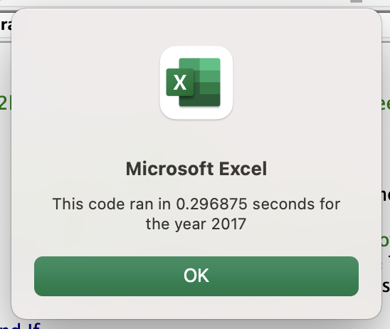
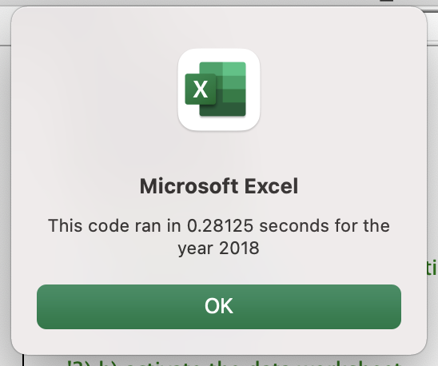
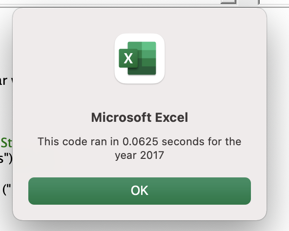
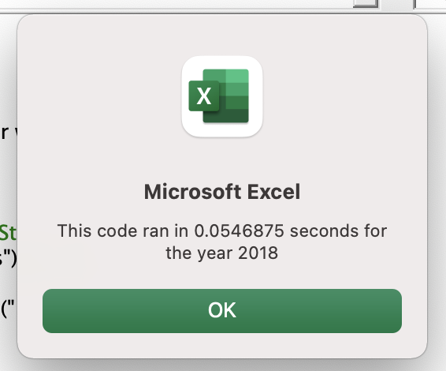

# Deliverable 2: Written Analysis of Results 

## Overview

The purpose of this analysis was to help Steve run a faster and more streamlined report showing return data for the entire stock market in 2017 and 2018. The return data will tell Steve which stocks have yielded a positive or negative return over the timeframe selected. We’ve been asked to refactor the code to make the original run we performed faster.

## Results

Stock performance between 2017 and 2018:
2017 proved to be a much better year for the stocks selected than 2018. All stocks except TERP yielded positive returns. In 2018 however, all but two stocks (ENPH and RUN) yielded negative returns. See screenshots below.

Execution times between original and refactored script: 
2017 unrefactored: 0.297 seconds
2017 refactored: 0.0625 seconds
2017 Delta: 0.2345 seconds
2018 unrefactored: 0.281 seconds
2018 refactored: 0.055 seconds
2018 delta: 0.226 seconds

For both run times (2017 and 2018), refactoring cut the run time by about 75%. That’s a considerable difference! 

## Summary

1. What are the advantages or disadvantages of refactoring code?
Advantages of refactoring code include faster run time, and theoretically cleaner and more efficient code. With proper comments/notes, refactored code can be easier to read and update/maintain for another coder who may be working on it with you / after you. 
The main disadvantage in my opinion is that refactoring takes a quite a bit of time! Refactoring was a lot more trial and error, as well as debugging. Certainly a disadvantage if you’re short on time. 

2. How do these pros and cons apply to refactoring the original VBA script?
In the case of this VBA script, the main pro is that run time was cut by a considerable margin, which is what Steve asked of us. But while time wasn’t a huge issue here, the debugging disadvantage did become a bit burdensome at times. 

